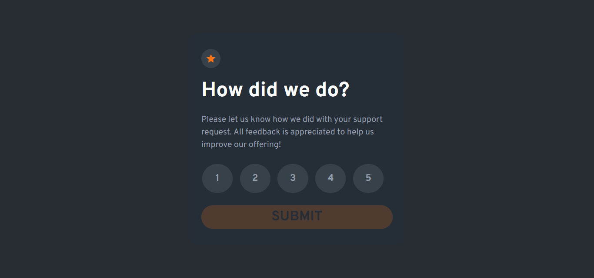
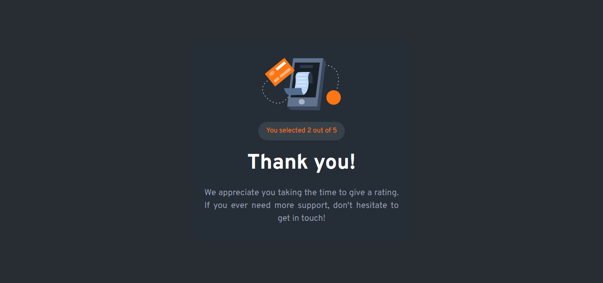

# Frontend Mentor - Interactive rating component solution

This is a solution to the [Interactive rating component challenge on Frontend Mentor](https://www.frontendmentor.io/challenges/interactive-rating-component-koxpeBUmI). Frontend Mentor challenges help you improve your coding skills by building realistic projects. 

## Table of contents

- [Overview](#overview)
  - [The challenge](#the-challenge)
  - [Screenshot](#screenshot)
  - [Links](#links)
- [My process](#my-process)
  - [Built with](#built-with)
  - [What I learned](#what-i-learned)
  - [Continued development](#continued-development)
- [Author](#author)

## Overview

### The challenge

Users should be able to:

- View the optimal layout for the app depending on their device's screen size
- See hover states for all interactive elements on the page
- Select and submit a number rating
- See the "Thank you" card state after submitting a rating

### Screenshot

### Links

- Solution URL: (https://github.com/jacey10/fm-interactive-rating-component-challenge)
- Live Site URL: (https://jacey10.github.io/fm-interactive-rating-component-challenge/)

## My process

### Built with

- Semantic HTML5 markup
- CSS custom properties
- Flexbox
- CSS Grid
- JavaScript
- Mobile-first workflow
- Event-Driven Architecture

### What I learned

- My understanding of Event Delegation was reinforced.

### Continued development

- I'm currently focusing on building projects that tests and sharpens my intermediate JavaScript skills.

## Author

- Website - [Jacey Blog](https://www.jacey.hashnode.dev/)
- Frontend Mentor - [@jacey10](https://www.frontendmentor.io/profile/jacey10)
- Twitter - [@jacey_muna](https://x.com/jacey_muna)
